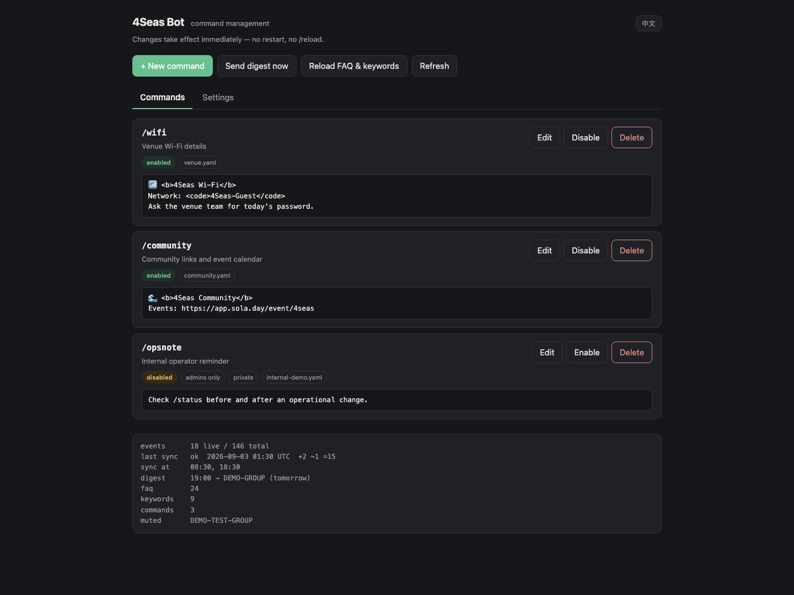
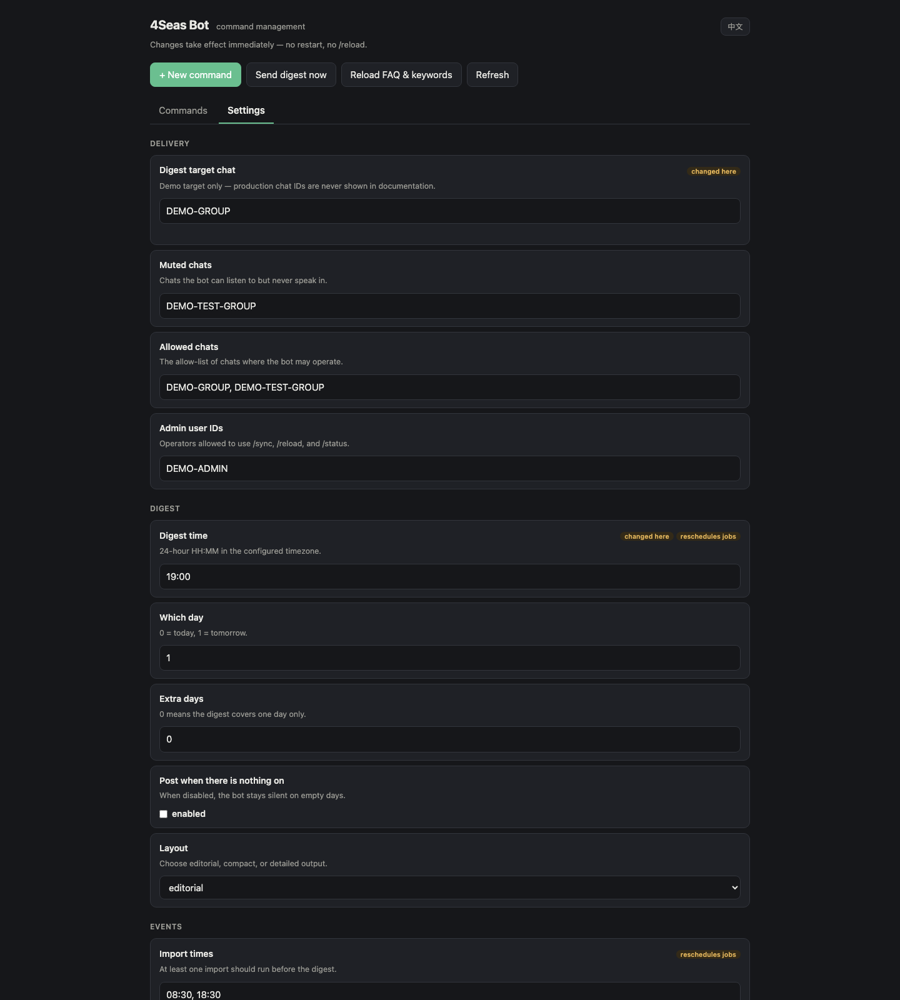

<div align="center">


# 4Seas Bot

**The Telegram operations bot for the 4Seas community.**

[](https://github.com/4seas-community/4Seas-bot/releases)
[](pyproject.toml)
[](LICENSE)

[Employee guide](#employee-guide) · [Commands](#telegram-commands) · [Admin console](#admin-console) · [Development](#local-development) · [Deployment](deploy/README.md)

</div>

---

4Seas Bot publishes event digests, answers common community questions, welcomes new members, responds to configured keywords, and gives operators a small web console for routine changes. It currently serves the 4Seas Telegram community and imports events from [Social Layer](https://app.sola.day/event/4seas).

English is the default language for project documentation, bot replies, and operator-facing examples.

## Employee guide

Most employees only need Telegram:

1. Open the 4Seas community group or a private chat with [@zuchiangmaibot](https://t.me/zuchiangmaibot).
2. Use `/events` to see upcoming events.
3. Use `/ask <question>` for a community question, or mention the bot in a message.
4. Use `/help` when you need the current command list.

Operators can also use the admin-only commands and the web console described below. If a command marked **Admin** does not respond, your Telegram user ID is probably not in `TELEGRAM_ADMIN_IDS`.

## Core features

| Feature | What it does | Default behavior |
|---|---|---|
| Daily event digest | Publishes a readable preview of the next day's events | 19:00, `Asia/Bangkok` |
| Event sync | Imports upcoming events from Social Layer into local SQLite storage | 08:30 and 18:30 |
| Community Q&A | Answers from the maintained FAQ through `/ask` or an @mention | English; says it does not know when evidence is missing |
| Member interaction | Welcomes new members and responds to relevant mentions | Enabled in allowed, unmuted chats |
| Keyword responses | Posts a configured answer when a rule matches | Per-chat cooldown prevents spam |
| Custom commands | Adds commands such as `/wifi` without changing Python code | YAML files or the admin console |
| Safe targeting | Separates allowed chats, muted chats, and the digest destination | Production changes are validated before saving |

The digest is not a raw event export. It generates concise editorial copy, includes useful facts such as price, capacity, deadline, or prize pool when available, and avoids inventing events when the source has no data.

## Telegram commands

### Commands for everyone

| Command | Purpose |
|---|---|
| `/start` | Introduce the bot |
| `/help` | Show available commands |
| `/events` | Show tomorrow's events |
| `/events 3` | Show events over a wider date range |
| `/ask <question>` | Ask a question using the community FAQ |
| `/faq` | List FAQ topics |
| `@botname <question>` | Ask the bot naturally in a group |
| `/wifi`, `/community`, etc. | Run an enabled custom command |

### Admin commands

| Command | Purpose | Notes |
|---|---|---|
| `/sync` | Import events immediately | Safe to repeat; imports are idempotent |
| `/reload` | Reload FAQ, keyword rules, and custom commands | Use after editing content files |
| `/status` | Show sync, event, and configuration status | Run before and after operational changes |

Admin commands are hidden from and ignored for non-admin users. Access is based on the user IDs in `TELEGRAM_ADMIN_IDS`, not Telegram's group-admin role.

## Admin console

The bot includes a local web console at:

```text
http://127.0.0.1:8477/
```

The console is intentionally bound to loopback by default. On a remote server, open it through an SSH tunnel instead of exposing the port publicly:

```bash
ssh -N -L 8477:127.0.0.1:8477 <user>@<server>
```

Then open `http://127.0.0.1:8477/` in your browser. See the [deployment guide](deploy/README.md#access-the-admin-console-from-macos) if SSH TCP forwarding is disabled on the server.

### Command management

Create, edit, enable, disable, and delete custom Telegram commands. Changes become active immediately. The editor validates Telegram HTML before saving so a malformed reply does not fail silently in the group.



### Runtime settings

Change the digest target, allowed and muted chats, schedules, digest format, import window, reply language, and rate limits. Schedule changes are applied without restarting the bot. A new target chat must already contain the bot, and the bot must have permission to post there.



> The screenshots use local demo data. They do not contain production chat IDs, admin IDs, tokens, passwords, or API keys.

### Main operator actions

- **New command** adds a custom Telegram command.
- **Send digest now** immediately posts to the configured digest target. Read the confirmation carefully; a sent Telegram post cannot be recalled by this tool.
- **Reload FAQ & keywords** refreshes content without restarting the service.
- **Settings** applies routine runtime configuration and reschedules jobs when required.
- The status panel shows live/total events, the most recent import, schedules, content counts, and muted chats.

### Password login

Generate a strong password and write its scrypt hash to `.env`:

```bash
python -m bot.web.passwd
```

Use `python -m bot.web.passwd --ask` to choose your own password. Restart the service after changing `.env`. Only the salted scrypt hash is stored; the clear-text password is printed once.

## Routine operations

Before changing production behavior:

1. Run `/status` and confirm that the latest event sync succeeded.
2. Verify the intended target chat in the admin console.
3. Make one scoped change.
4. Save and confirm the new value in the console.
5. Run `/status` again and check service logs if the change affects delivery.

Content that employees may update without changing Python code:

| Path | Purpose | Apply with |
|---|---|---|
| `data/faq.md` | Q&A knowledge base | `/reload` or **Reload FAQ & keywords** |
| `data/keywords.yaml` | Keyword response rules | `/reload` or **Reload FAQ & keywords** |
| `data/commands/*.yaml` | Custom Telegram commands | `/reload` or the admin console |

Example custom command:

```yaml
- command: wifi
  description: Venue Wi-Fi details
  reply: |
    📶 <b>Wi-Fi</b>
    Network: <code>4Seas-Guest</code>
  enabled: true
  admin_only: false
  scope: all                 # all | group | private
```

## Operational guardrails

- Never commit `.env`, bot tokens, API keys, web credentials, production chat IDs, or admin user IDs.
- Run only one polling instance for a Telegram bot token. A second instance causes update conflicts.
- Keep the web console on `127.0.0.1`; use an SSH tunnel for remote access.
- Prefer the muted-chat list when temporarily silencing a known group. Removing a group from the allow-list can cause the bot to leave it, depending on deployment settings.
- Confirm the digest target before using **Send digest now**.
- If keyword responses are required, disable privacy mode in BotFather and remove/re-add the bot to the group so Telegram applies the change.
- A sleeping laptop cannot run the scheduled job. Use the always-on server for production.

## How it works

```text
Social Layer         08:30 / 18:30          Local SQLite          19:00
api.sola.day   ───── event import ─────▶  idempotent events  ───── digest ───▶ Telegram
                                              ▲
                                              ├── /events
                                              ├── Q&A context
                                              └── admin status
```

The importer uses upserts, content hashes, and soft deletion, so repeating a sync does not create duplicate events. The 18:30 import exists to catch events added during the day before the 19:00 digest. If the primary Social Layer API is unavailable, the importer can fall back to iCal and local YAML data.

## Local development

Requirements: Python 3.11+ and [`uv`](https://docs.astral.sh/uv/).

```bash
git clone git@github.com:4seas-community/4Seas-bot.git
cd 4Seas-bot
uv sync --extra dev --locked
cp .env.example .env
./start.sh
```

Useful local commands:

```bash
./start.sh --bg       # start in the background; logs go to data/bot.log
./start.sh --status   # show process status
./start.sh --stop     # stop the local process
uv run pytest -q      # run the test suite
```

The test suite does not require real credentials. Test fixtures supply placeholder configuration and prevent accidental loading of a developer's `.env` file.

### Required configuration

Copy `.env.example` to `.env` and set at least:

```dotenv
TELEGRAM_BOT_TOKEN=
TELEGRAM_ADMIN_IDS=
TELEGRAM_ALLOWED_CHATS=
DEEPSEEK_API_KEY=
SOLA_GROUP=4seas
TZ=Asia/Bangkok
```

`OPENAI_API_KEY` is optional as a fallback provider. The complete configuration reference, including admin-console settings, is documented in [`.env.example`](.env.example).

To discover a chat ID, add the bot to the chat, send one message, stop the running bot, and run:

```bash
uv run python scripts/chat_ids.py
```

Do not run this helper while the bot is polling; both processes would compete for Telegram updates.

## Deployment

Production uses Telegram long polling, so it does not require a public IP, domain, or TLS certificate. Linux/systemd is recommended for the always-on service. See [deploy/README.md](deploy/README.md) for installation, service control, logs, remote admin access, release deployment, verification, and rollback notes.

## Troubleshooting

| Symptom | Check |
|---|---|
| Admin command does not respond | Confirm your user ID is in `TELEGRAM_ADMIN_IDS` |
| Keyword rules never trigger | Disable BotFather privacy mode, then remove and re-add the bot |
| Digest did not send | Check `/status`, target chat, muted chats, last sync, and service logs |
| `409 Conflict` from Telegram | Stop the duplicate polling instance |
| Admin console does not open remotely | Keep the service on loopback and verify the SSH tunnel/local relay |
| A custom command sends nothing | Validate Telegram HTML and reload the command configuration |

## License

Apache-2.0. Self-hosted runtime data remains on the deployment host.
